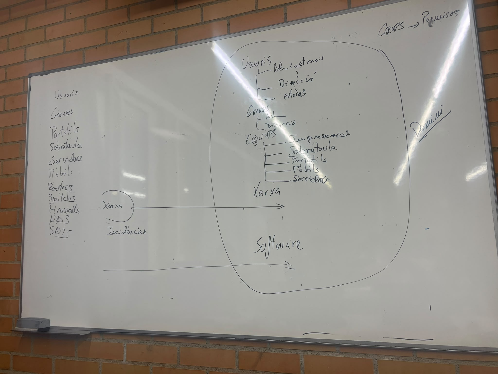

# RA-1
## Empresa 1 ***`musicCloud`***
Numero de trebalaldors 14.

## Departaments:
| Departament       | Funció                                      |
| ----------------- | ------------------------------------------- |
| Direcció          | Gestió general de l'empresa                 |
| Administració     | Factures, contractes i documentació interna |
| Suport tècnic     | Manteniment de sistemes i incidències       |
| Producció musical | Gestió de continguts musicals               |
| Informàtica       | Suport sistema informàtic                   |
| *externs*         | *Usuaris temporals o externs*               |
|                   |                                             |

## Treballadors:

Cada treballador està assignat a un departament. Cada departament, excepte direcció, consta també d'un treballador que fa les funcions de cap de departament.

| Treballadors                                                                                              | Departament       | Cap de departament |
| --------------------------------------------------------------------------------------------------------- | ----------------- | ------------------ |
| Aina Ciurans<br>Rut Tornil                                                                                | Direcció          |                    |
| Dídac Gassó<br>Laia Macias                                                                                | Administració     | Laia Macias        |
| Estel Birosta<br>Aina Zuriguel<br>Lluïsa Richart                                                          | Suport tècnic     | Lluïsa Richart     |
| Roser Alberch<br>Guillem Adella<br>Meritxell Reglat<br>Alícia Monclús<br>Carles Molins<br>Eulàlia Galcera | Producció musical | Meritxell Reglat   |
| Talia Costas<br> Alex Soriano                                                                             | Informàtica       | Talia Costas       |

A part d'aquests departaments, cal tenir en compte que en Pere Espinalt i la Neus Bages són treballadors externs a l'empresa.
..

*Els dos informatics son els dos unic usuaris que podirem posar como administradors.*
*  *Es desactiva l'usuari `administrador` pero s'els hi donaria permisos d'administrado a cada usuari del informatic*
---

### Carpetas:
```
/empresa
├── comu
│   ├── intercanvi
│   ├── plantilles
│   ├── comunicats
│   └── interdepartamental
│
├── departaments
│   ├── direccio
│   │   ├── compartida
│   │   └── confidencial
│   │
│   ├── administracio
│   │   ├── compartida
│   │   ├── gestio_departament
│   │   └── documentacio_interna
│   │
│   ├── suport_tecnic
│   │   ├── compartida
│   │   ├── gestio_departament
│   │   ├── incidencies
│   │   └── scripts
│   │
│   └── produccio_musical
│       ├── compartida
│       ├── gestio_departament
│       ├── artistes
│       └── cataleg
│
├── usuaris
│   ├── usuari1
│   ├── usuari2
│   └── usuari3
│   └── ....
│
├── projectes
│   ├── campanya_estiu
│   └── migracio_servidors
│
└── administracio_sistema
    ├── backups- Informatica, Si fosin mes de 2 (Només el responsable i el cap d'informatica.)
    ├── logs
    ├── configuracions
    └── inventari
```
---

## ***Estructrua dels permisos***:
- GRP_admin
    - Didac
    - grp_resp_Adm_
- grp_Reps_Adm_
    - Laia

## Ideas:
- Minim privilegi (Vigilar externs),(Permisos).
- Recurs 
- Identitat (Usuari,Grup)



## Usuaris amb el mateix nom

OU = Adminsitració
    CN = Laia   `info`

OU = Producio
    CN = Laia   `info`

`Info`
    -> Dni, cognoms, Usuari, Telefon

Distingui had
DN
RDN -> Relative

CN =Laia, OU=Administracio,OU=Usuaris,dc=musiicloud,dc=local
**`Això seria RDN`**

## Noms :
Usuaris -> Incial Nom + Cognom

Equips                                ->PC-adm.01 /no
                                      ->PC-Nomserie o un numero        
        -> Diferenciar per tipus: ->PC 
                                  -> PT
                                  -> PH
                                  -> Por
## Grups
GR_
## Objectes

User
    -> Atributs:
        -> CN, uid(UserID),
*Aquest ID unic és important per si dos objectes tenen el mateix nom per mai tindran el mateix ID*

*Mentre l'ID sigui el mateix dona igual el que cambi que l'usuari sera el mateix per tant tot l'aplicat seguiex aplicat*
