    Nota: Els exercicis/pràctiques t'han de servir per a familiarizar-te amb el llenguatge Powershell. Aprofita per a realitzar diverses proves i veure què passa. Documenta també aquestes proves i resultats.

Treballar amb variables
1. Crear variables

Crea les variables següents:

$nom
$servidor
$ip
$port

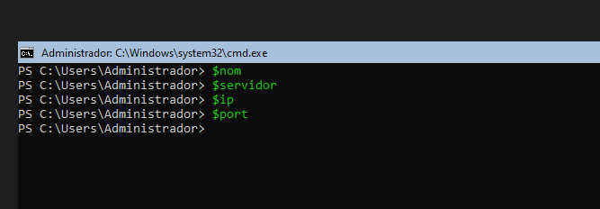

Assigna-hi valors.


$nom = "Pere"


Mostra després el contingut de cadascuna de les variables.

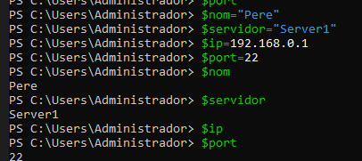

1. Modificar una variable

Crea:

$servidor = "SRV01"

Mostra el seu valor.

Després canvia'l per:

SRV02

Comprova quin valor conserva la variable.

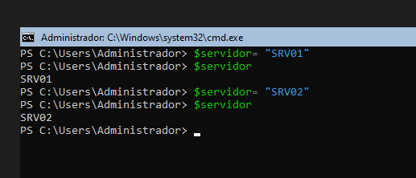

3. Operacions

Crea dues variables:

$num1 = 20
$num2 = 5

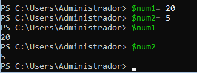


Crea una tercera variable que guardi:

    la suma;
    la resta;
    la multiplicació;
    la divisió.

Per exemple:

$resultat = $num1 + $num2

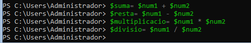


Mostra cada resultat.

## Resultat Suma:

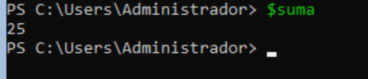

## Resultat Resta:

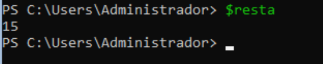

## Resultat Multiplicació:

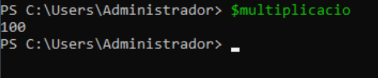


## Resultat Divisió:

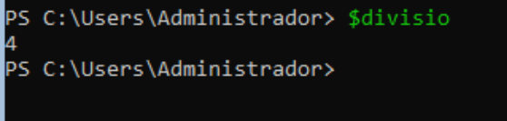


4. Variables dins d'un text

Crea:

$nom = "Anna"
$servidor = "SRV01"

Intenta obtenir aquesta sortida:

L'usuari Anna està treballant amb el servidor SRV01

utilitzant les variables dins del text.

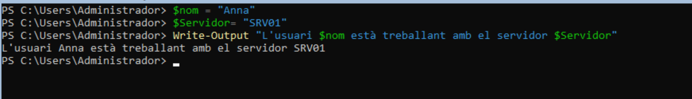


5. Cometes

Executa:

$servidor = "SRV01"
Després:

Write-Host "Servidor: $servidor"

i:

Write-Host 'Servidor: $servidor'

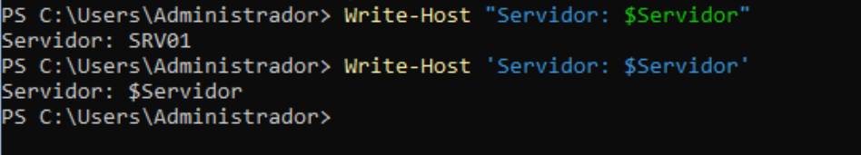

Respon:

Quina diferència observes? Per què creus que passa?

La diferencia és que  Les cometes dobles " " permeten que PowerShell substitueixi les variables pel seu valor. 

Les cometes simples ' ' tracten el contingut com a text literal i, per tant, $servidor no es substitueix.

6. Guardar el resultat d'una ordre

Executa:

$serveis = Get-Service

Després:

$serveis

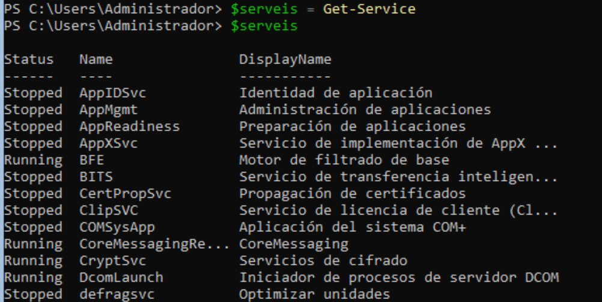

Respon:

    Què creus que conté $serveis?
*Conté el resultat de l'ordre `Get-Service`, és a dir la informació dels serveis del sistema.*

    La variable conté un únic valor o diversos elements?
*Conté diversos **elements**, un per cada servei que retorna `Get-Service`.*

*Fes el mateix amb:*
```powershell
$processos = Get-Process

```

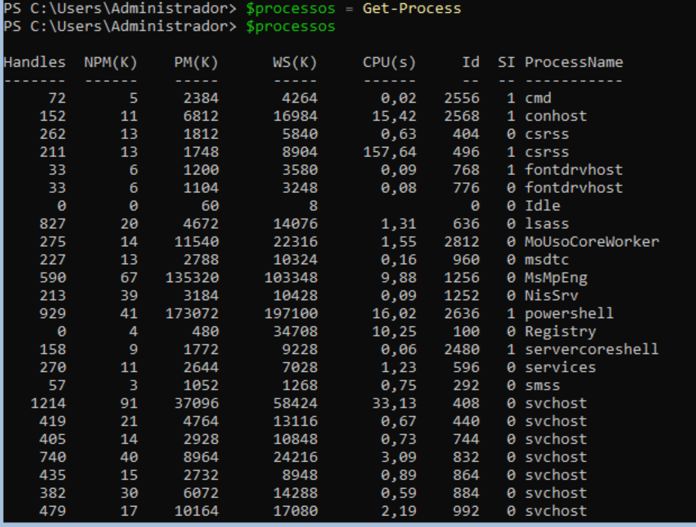


`Què creus que conté $processos?`

*Conté la informació dels processos que estan executant-se en l'equip.*
`Conté un únic valor o diversos elements?`

*Conté diversos elements, un per cada procés.*

7. Aplicació a administració

Crea una variable:

$nomServei = "Spooler"

Utilitza aquesta variable per consultar el servei amb:

Get-Service -Name ...

L'objectiu és obtenir el mateix resultat que:

Get-Service -Name Spooler

però sense escriure Spooler directament en el cmdlet.