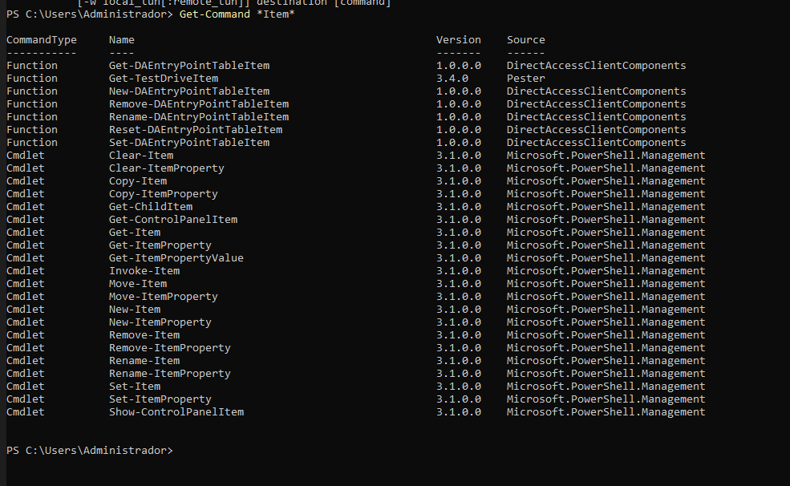
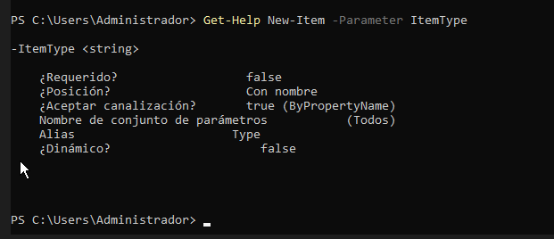
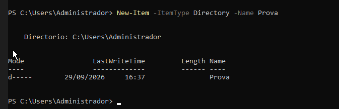

Treballar amb fitxers i carpetes

Situació: encara no hem estudiat les ordres de PowerShell per treballar amb fitxers i carpetes. Les haurem de descobrir utilitzant les eines d'ajuda de PowerShell.

1. Buscar ordres

Busca cmdlets que continguin la paraula Item:

Get-Command *Item*

Observa les ordres que apareixen.

Intenta identificar quina ordre podria servir per:

    crear un element;
    "New-Item"
    eliminar un element;
    "Remove-Item"
    canviar el nom d'un element;
    "Rename-Item"
    copiar un element;
    "Copy-Item"
    moure un element.
    "Move-Item"

2. Investigar una ordre

Sense executar-la encara, consulta què fa:

Get-Help New-Item

Respon:

    Per a què serveix New-Item? 
    "Per crear un nou element."
    Quina estructura té l'ordre?
    "New-Item [-Path] <string[]> [<CommonParameters>]

Consulta alguns exemples:

Get-Help New-Item -Examples

3. Descobrir un paràmetre

Consulta què significa el paràmetre -ItemType:

Get-Help New-Item -Parameter ItemType

A partir de l'ajuda, intenta descobrir com crear una carpeta.

Per exemple, haurien d'arribar a alguna cosa semblant a:

New-Item -ItemType Directory -Name Prova

4. Nou repte

Ara necessites saber com canviar el nom de la carpeta, però no coneixes l'ordre.

Utilitza:

Get-Command *Item*

i després consulta l'ajuda de l'ordre que creguis adequada.

L'objectiu és arribar a descobrir:

Rename-Item

i consultar:

Get-Help Rename-Item -Examples

Sense utilitzar Internet, descobreix quins cmdlets faries servir per:

    crear una carpeta;
    "New-Item -ItemType Directory -Name NomCarpeta"
    canviar-li el nom;
    "Rename-Item Nomactual NomNou"
    copiar-la;
    "Copy-Item Carpetaorigen carpetadesti"
    moure-la;
    "Move-Item Carpetaorigen carpetadesti"
    eliminar-la.
    "Remove-Item nomcarpeta"
Condició: només pots utilitzar Get-Command i Get-Help per investigar les ordres.

Descobrir ordres de xarxa amb PowerShell
Situació

Estàs administrant un servidor Windows i necessites consultar informació de la seva configuració de xarxa.

Encara no coneixes les ordres de PowerShell relacionades amb xarxa.

La teva feina és descobrir-les utilitzant principalment:

Get-Command
Get-Help

No pots buscar les respostes a Internet.
Tasques

Descobreix quines ordres de PowerShell et permeten obtenir la informació següent:

    Mostrar els adaptadors de xarxa de l’equip.
    Consultar les adreces IP configurades.
    Consultar la configuració IP completa dels adaptadors de xarxa.
    Consultar els servidors DNS configurats.
    Comprovar si hi ha connectivitat amb un altre equip de la xarxa.

Per cada tasca

Indica:

    el cmdlet que has trobat;
    com l’has localitzat amb Get-Command;
    una breu explicació del que fa;
    la comanda que has executat;
    el resultat obtingut.

L'objectiu és que hi hagi una traçabilitat de com s'ha arribat a la comanda final.